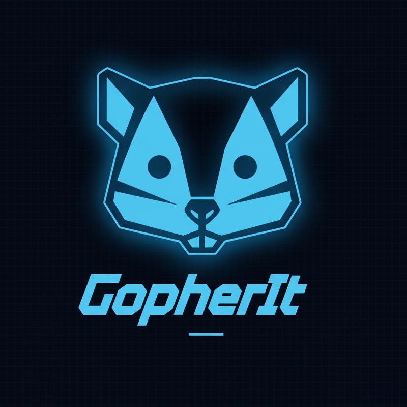
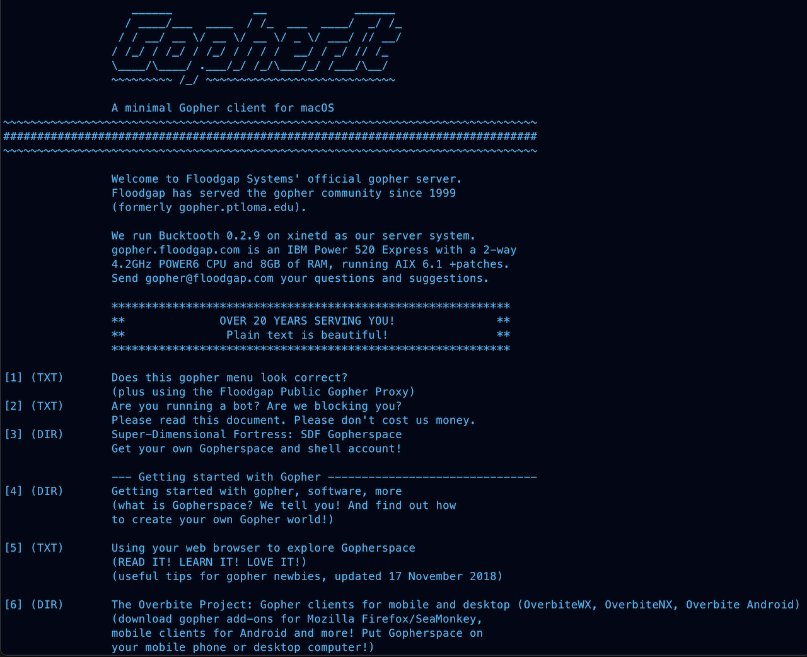
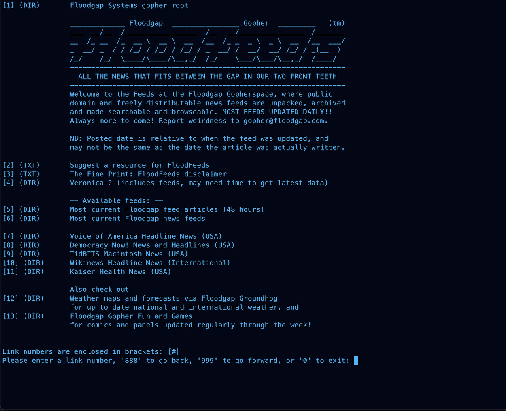
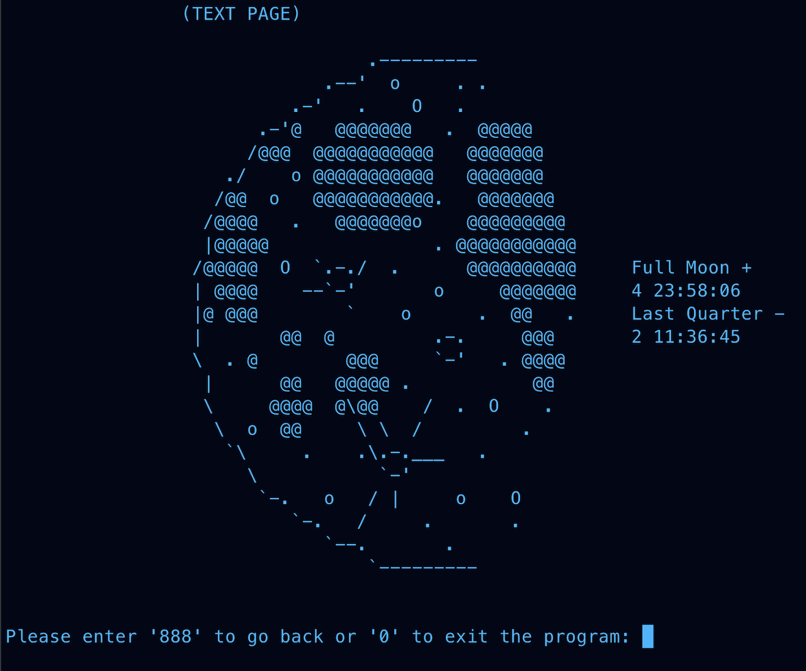

	

# GopherIt - A minimal Gopher client for macOS

**GopherIt** is a fast, minimal, and user-friendly [Gopher](https://en.wikipedia.org/wiki/Gopher_(protocol)) 
protocol client for macOS. Designed for the terminal, GopherIt allows you to explore the early internet 
through a lightweight CLI client.

---

	
	
	

---

## Summary
GopherIt is a terminal-based Gopher client written in C. It uses POSIX/BSD sockets for networking, 
implements page caching, and parses RFC 1436-compliant server responses. 
Its source code is private due to employer policy; implementation details are available upon request.

## Features
- <ins>Keyboard-driven</ins>: browse Gopher menus and text files via the CLI
- <ins>Scriptable</ins>: access links using numerical values and the return key
- <ins>Navigable</ins>: retrace your steps seamlessly with backward/forward functionality
- <ins>Efficient</ins>: experience minimal network overhead and low system impact
- <ins>Intuitive</ins>: enjoy a straightforward and simple user interface

## Technical Highlights
- Low-level network programming (POSIX/BSD sockets, TCP/IP)
- Dynamic memory management in C (custom buffers, linked lists)
- Protocol-based parsing (RFC 1436)
- Modular, reusable C code design

---

# Project Details

<ins>Note</ins>: GopherIt is a personal project that I wrote using the C programming language, its standard 
libraries, and my own project-based headers and source files. Presently, employer policy prevents me from sharing its source code, 
but I would be happy to discuss GopherIt in-depth during an interview.

## Inspiration
I decided to build GopherIt while participating in a mentorship program with an experienced software engineer. 
As a mentee, I was eager to get to work on something unfamiliar and challenging. The Gopher protocol and its historical 
significance had arisen as a topic of casual conversation, and right away I wanted to learn more. The notion of a clutter-free internet experience seemed like a refreshing change from the modern web. I also liked the idea of gaining more familiarity with Unix network programming, the Berkeley sockets API, and how to craft my own modular code in a systems-level programming language. Ultimately, I chose to 
implement it from scratch by writing a CLI-based Gopher client application in C.

## Approach
I first needed to familiarize myself with [RFC 1436: The Internet Gopher Protocol](https://www.rfc-editor.org/rfc/rfc1436), 
which presented an interesting challenge in its own right. At this stage I learned how to digest protocol-level technical documentation, 
gaining an appreciation for the nuances involved in conducting research and preparing for a project on a granular level.

After gaining a basic understanding of the Gopher protocol, I started to draft out the major steps of my project. I loosely defined these as follows:

- Start GopherIt by accepting a user-defined destination
- Perform a DNS lookup and connect to the remote Gopher server
- Obtain a response from the server, caching and parsing it
- Render the Gopher page and prompt the user for a new destination or relevant navigation commands (i.e. 'back', 'forward', 'exit')
- Navigate to the requested page
- Repeat
	- If the next page has been previously visited, GopherIt simply accesses the page cache and re-processes the page
	- If the next page is new, GopherIt fetches the new page information from the server prior to processing the page

### Implementation
In addition to some raw business logic, much of GopherIt consists of custom functions which encapsulate various POSIX and BSD sockets APIs. This helps establish clarity, modularity, and consistent error handling throughout the application. Examining the implementation of GopherIt, there are a few points to highlight here:

#### Startup
- When starting GopherIt, the user-supplied destination hostname is validated for acceptable input length (1 - 255 chars)

#### Networking
- GopherIt performs a standard DNS lookup via the getaddrinfo API
- TCP/IP is likewise implemented through the Berkeley sockets API
- As per the Gopher protocol:
	- When first querying the Gopher server (after establishing a connection), a single newline character is transmitted to solicit the server's landing page
	- Subdirectories and additional pages of the Gopher server are accessed by instead transmitting a selector string, which represents a server endpoint
	- In both cases, the server should respond with raw text that represents an unparsed Gopher page
 
#### Caching
- The raw server response is stored in a dynamic buffer, which can resize itself as needed
- As currently implemented, the raw response is cached in a doubly-linked list
	- This cache prevents redundant DNS lookups and adds backward/forward functionality

#### Parsing
- The raw response must then be parsed to prepare for displaying on the terminal
	- The raw response is first broken down into individual rows, storing each row in a 2-dimensional array
	- Each line is then parsed to extract the various components of the Gopher data (i.e. line type, display string, selector string, host, port)
   		- This is stored in a C-struct that is then utilized to render the page
 
#### Rendering
- GopherIt renders the page by iterating over the various parsed lines which constitute the page, displaying numerical links as appropriate and display strings for each line

#### Navigation
- The user is then prompted for a link or navigation command to follow
	- As appropriate, GopherIt either iterates through the links on the page, checking for a match, or prepares to render a previously cached page
	- If navigating to a link, the relevant selector string is transmitted to the server
	- If visiting a cached page, GopherIt parses the cached raw response representing the page, renders it, and updates the cache cursor as needed

---

## Obstacles
I encountered a handful of challenges to overcome while working on GopherIt:
- <ins>Processing Logic</ins>: gaining a sense of how to efficiently manage system calls and data fetching from remote servers
- <ins>Data management</ins>: unwinding how to best store, extract, parse, and present information obtained from server responses
- <ins>Memory management</ins>: avoiding classic pitfalls of C; managing manual allocation and deallocation efficiently
- <ins>Security</ins>: appreciating the need for adequate input validation/sanitization and error handling
- <ins>Technical debt</ins>: realizing that my initial approach was not optimal partway through development, refactoring as needed
- <ins>Coherence/Coupling</ins>: developing a better understanding of how custom APIs and design choices impact code hygiene and complexity

These challenges served as excellent learning opportunities and are now key factors that I take to heart moving forward.

## Opportunities
### Automated Testing
- I debugged GopherIt entirely manually, without the use of automated tests, relying on stack traces and CLI tools to resolve memory leaks
	- For future projects, I would focus extensively on incorporating automated testing
 
### Technical Debt
- Having gained a better understanding of C by now, I would refactor a significant portion of the source code to reduce complexity
and improve modularity even further

### Better Efficiency
- Rather than re-parsing raw cache pages when moving 'backward' or 'forward', I would strive to simply re-render based on preprocessed data

### Additional Features
- Many more features could be implemented. Two standouts are:
	- Navigation to new servers after starting GopherIt
		- Must currently restart application to do this
	- DNS caching when navigating to different servers

## Takeaways
This project represents a number of novel experiences for me. Building GopherIt was the first time that I:
- Developed a non-trivial application
- Programmed in C: researching, reflecting, and learning hands-on through trial and error as I went
- Programmed in a procedural language: adapting prior experience with OOP (e.g. Python, Java) to C's idiosyncracies
- Directly managed memory manually: gaining an appreciation for the considerations and risks involved
- Worked with the Berkeley sockets API to implement TCP/IP connectivity and DNS resolution capability
- Utilized version control (Git + GitHub) for a self-directed personal project and used the Xcode IDE
- Weathered the frustration and discomfort of sometimes feeling stuck in a software project
